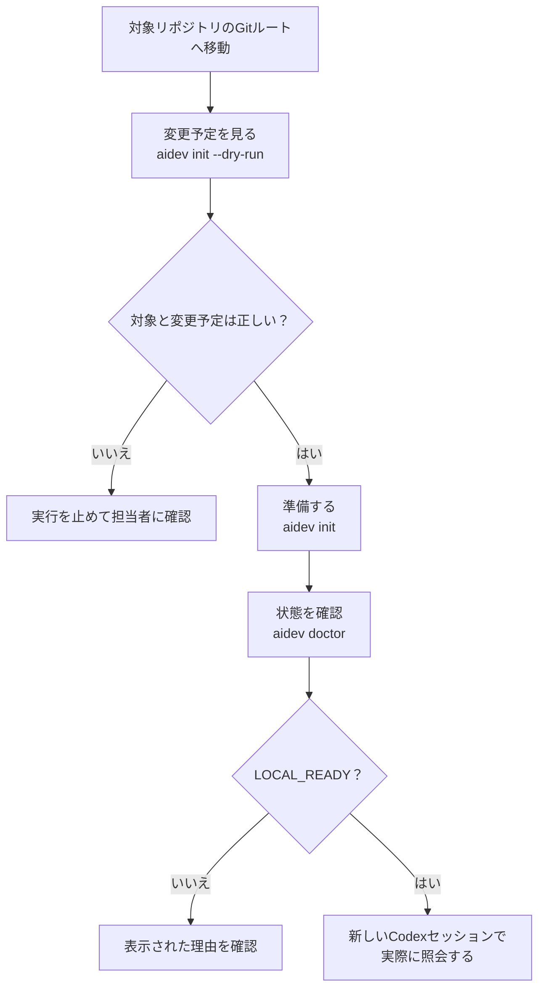

# aidev 操作ガイド

このガイドは、初めてaidevを使うジュニアSE向けです。Ubuntuのターミナルで、解析したいGitリポジトリの準備からCodexでの確認まで進めます。Windowsで導入する場合は [Windows向け手順](WINDOWS.md) を先に読んでください。

すでに `aidev --version` が使えるなら、[「対象リポジトリで使う」](#first-run) から始めてください。導入担当者は [「aidevを導入・更新する」](#install) を参照してください。

<a id="basics"></a>
## aidevで何をする？

aidevは、Serena・Graphify・CRGという3つの解析ツールを、対象リポジトリで使うための設定と検索用データを準備します。関数の定義や参照、コードの関係を調べる助けになります。**aidev本体のソースがある場所と、解析するリポジトリは別です。**

| 言葉 | このガイドでの意味 |
|---|---|
| リポジトリ | Gitで管理しているプロジェクト |
| ルート | リポジトリの一番上のフォルダー |
| 索引 | コードを検索するために解析ツールが作るデータ |
| provider | Serena・Graphify・CRGのような、実際に解析するツール |

たとえば、この環境ではaidevのソースは `/home/tn/projects/aidev` にあります。別のプロジェクトを調べるとき、`aidev init` や `aidev doctor` は**そのプロジェクトのGitルート**で実行します。図の「対象リポジトリ」は、調べたいプロジェクトを指します。



<a id="first-run"></a>
## 対象リポジトリで使う

以下の `/absolute/path/to/your-repo` は説明用です。実際に解析したいリポジトリの絶対パスに置き換えてください。コマンドは1ブロックずつ実行し、結果を確認してから次へ進みます。

### 1. 場所を確かめる

```sh
cd /absolute/path/to/your-repo
pwd
git rev-parse --show-toplevel
git status --short
aidev --version
```

`pwd` と `git rev-parse --show-toplevel` が同じ対象を示しているか確認します。`aidev --version` が見つからなければ [導入手順](#install) を確認してください。未commitの変更があっても、勝手に破棄する必要はありません。誰の変更か把握し、初期化中のコード編集や別の解析処理を止めます。

秘密情報・顧客データ・生成物がある場合は、対象リポジトリのGit除外と解析対象の設定を確認してください。aidevは機密データを自動で見分けません。

### 2. 変更予定を見る

```sh
aidev init --dry-run
```

`PLAN` と `writes: false` が表示されれば、まだ設定や索引を書き換えていません。表示された `root` が対象リポジトリか、`files_to_change` に意図しない設定ファイルがないかを確認します。`source_files` が想定外に0なら、コードの有無や除外設定を調べます。判断できない変更があれば、ここで止めて担当者に確認します。

### 3. 準備して診断する

```sh
aidev init
aidev doctor
```

`init` は設定と対象リポジトリのルートの実効指示ファイルに短い使い分けを保存し、Serena → Graphify → CRGの順に解析します。非空の `AGENTS.override.md` があればそこへ、なければ `AGENTS.md` へ保存します。既存の記述や設定を変更する場合は、変更前のテキストをバックアップします。`doctor` は設定と索引の状態を**書き換えずに**確認します。指示ファイルが長い場合はCodex側の読込み上限による切詰めがあり得るため、新規セッションで実際の利用を確認してください。

`doctor` が `LOCAL_READY` と表示すれば、3providerのローカル準備は完了です。任意導入のTerrainは別行で確認してください。`init` の結果が `WAITING_FOR_CODE` なら、対応するコードの追加を待っています。それ以外の表示は [「表示の読み方」](#results) を見てください。`LOCAL_READY` だけではCodexからの接続成功までは確認できません。

解析の時間上限は各providerの処理ごとに既定で600秒です。全体の所要時間の上限ではありません。時間が足りない場合は、ログを確認してから [時間切れの対応](#troubleshooting) に進みます。

初回のSerena解析では言語サーバーの取得が発生する場合があります。完全なオフライン動作は保証していません。通常の3providerによる索引構築では外部LLMによる抽出やembeddingを行いません。Codex利用時の通信は別です。

### 4. 何が変わったか確認する

```sh
git status --short
git diff --stat
git diff
```

`git status --short` の `??` は新しい未追跡ファイルです。その内容は `git diff` に出ないため、必要ならエディターで開いて確認します。aidevはcommit・pushをしません。自分や他の人の変更を一括でstageしないでください。

<a id="codex-check"></a>
## Codexから本当に使えるか確認する

対象リポジトリのGitルートで新しいCodexセッションを開き、表示された信頼確認に従います。

```sh
codex
```

Codexの**入力欄**で `/mcp` を入力し、SerenaとCRGが使えるか確認します。これはターミナルのコマンドではありません。GraphifyはCLIなので、MCP一覧に出なくても異常ではありません。Terrainも任意導入のCLIです。操作方法は [Codex公式の説明](https://learn.chatgpt.com/docs/developer-commands?surface=cli) でも確認できます。

次に、実在する関数やモジュールを一つ選び、**ツール名を指定せず**に依頼します。これはCodexが作業内容から能力を選ぶかの受入確認です。

```text
ソースを変更せず、「対象の関数名」の定義と参照元を調べてください。
使った調査手段と、根拠となるファイルの絶対パスを示してください。
```

```text
ソースを変更せず、「対象のモジュール」と他のモジュールの関係を調べてください。
使った調査手段と、実際のコードで確認した箇所を示してください。
```

```text
ソースを変更せず、現在の差分が及ぼす影響候補とテスト候補を調べてください。
比較対象を明示し、実際のコードと照合してください。
```

返ってきたファイルをエディターで開き、説明と一致するか確認します。Codexの実行履歴でSerena・CRGのMCP呼出しやGraphify CLI照会を確認します。通常検索だけの回答は追加能力を使えた証拠にはなりません。通常の作業で毎回追加能力を呼ぶ必要もありません。`codex_mcp: UNVERIFIED` はaidev自身が接続を検査していないという意味で、実照会後も表示は自動で変わりません。Terrain導入時は [Terrainの操作](TERRAIN.md) に従い、packが利用できる状態で場所不明の調査も試します。

<a id="daily"></a>
## 普段の使い方

作業開始時やコード編集・ブランチ切替の後は、対象リポジトリで `aidev doctor` を実行します。必要な能力の行が更新を求めたら、並行編集や設定衝突がないことを確認し、3providerは `aidev init --dry-run` → `aidev init`、既存Terrainは `aidev terrain init --dry-run` → `aidev terrain refresh` と進めます。各更新は同じ入力に対して一度試し、失敗や再失効時は実ソースで調べます。Terrain contextの生成は明示依頼時だけです。新しいcloneやworktreeでは、その作業先で初回手順から始めます。

aidevは変更を自動監視しません。索引の更新が必要なときは、3providerを順に処理します。

<a id="results"></a>
## 表示の読み方

| 表示 | 意味と次の行動 |
|---|---|
| `PLAN` | 変更予定。対象と変更内容を確認する |
| `LOCAL_READY` | ローカルの設定と索引は準備済み。Codexで実照会する |
| `WAITING_FOR_CODE` | 対応するコードを追加してから `aidev init` を再実行する |
| `NEEDS_INIT` | 表示された理由を確認し、必要なら `aidev init` を実行する |
| `INITIALIZING` | 解析途中の記録。処理中か、中断したかをログで確認する |
| `FAILED` / `ERROR` | エラー本文と、表示されたログの場所を確認する |
| `codex_mcp: UNVERIFIED` | Codex接続は未検査。新しいセッションで実照会する |

`aidev doctor --json` は機械処理向けの結果を表示します。`providers` に4経路それぞれの状態と必要な次のコマンドが入り、構築記録のある索引には日時・構築時HEAD・成果物IDも表示します。古いstateの日時は不明のままです。日時は鮮度の判定材料ではなく、`READY` は解析の網羅性やMCP接続の保証でもありません。終了コードは、3providerが成功なら0、要初期化なら1、エラーなら2です。任意のTerrainが未導入・不正でも3providerの終了コードは変えません。コードのないリポジトリで `init` が `WAITING_FOR_CODE` を返しても終了0になり得ます。`init --json` はありません。

<a id="troubleshooting"></a>
## 困ったとき

同じコマンドを繰り返す前に、エラー本文と表示されたログの絶対パスを確認します。providerのログは再実行で上書きされるため、必要な失敗記録は先に手元へ保全してください。秘密情報を含む可能性があるログを、内容確認前に外部へ貼らないでください。

| 症状 | 最初にすること |
|---|---|
| `aidev: command not found` | `/home/tn/.local/bin/aidev --version` を試す。なければ導入担当者に相談 |
| 「リポジトリのルートで実行」と表示 | `pwd` と `git rev-parse --show-toplevel` を見比べる |
| 共通基盤・承認・providerの版で停止 | 担当者に環境を確認してもらう。台帳を手編集して通さない |
| `source_files` が想定外に0 | Python・JavaScript・TypeScriptのコードと除外設定を確認する |
| 時間切れ | ログで原因を確認する。時間不足なら担当者と `aidev init --timeout 1800` を検討する |
| `LOCAL_READY` だがCodexで使えない | 対象リポジトリで新しいセッションを開いたか確認し、実際のツール呼出しを調べる |
| 設定の衝突、利用者変更、管理外ファイル、リンクのエラー | 対象を保全して担当者に相談する。削除や上書きで通さない |

<a id="recovery"></a>
## 戻したいとき

`init` が示す `backup:` は、変更前のテキストと変更一覧の保存先です。ソース全体や索引のバックアップではありません。**自動で元に戻すコマンドやuninstallコマンドはありません。**

担当者と一緒に、現在の設定と利用者変更を保全し、バックアップの変更一覧・元のテキスト・現在のファイルを比較してください。元からあったファイルかは一覧の `existed` で判別します。戻す必要がある設定だけを個別に復元し、最後に `git status --short` と `aidev doctor` で確認します。途中失敗では一部だけ変更された状態が残る場合があります。索引やログの一括削除、Gitの追跡解除を復旧に混ぜないでください。

<a id="support"></a>
## 担当者に相談するとき

対象リポジトリの絶対パス、`aidev --version`、実行したコマンド、表示された状態・終了コード・エラー、直前の変更を伝えてください。ログは秘密情報を除いた必要箇所だけ共有します。Codexについては「実照会は未実施／成功／失敗」を分けて伝えます。

<a id="install"></a>
## aidevを導入・更新する（導入担当者向け）

Python 3.11以降とGitが必要です。Serena 1.7.0、Graphify 0.9.55、CRG 2.3.8の実体と承認登録も必要です。aidevはこれらのツールを自動導入しません。準備方法と登録条件は [技術資料](TECHNICAL.md) と [Windows向け手順](WINDOWS.md) を確認してください。既存の共通基盤や承認台帳を変更するときは、担当者の運用手順に従います。

この環境ではソースを `/home/tn/projects/aidev` に置いています。別の環境では実際のcheckoutに読み替え、導入するソースの版とGit状態を先に確認してください。ソースとインストール済みコマンドは別です。

```sh
python3 --version
git -C /home/tn/projects/aidev status --short --branch
python3 -B /home/tn/projects/aidev/src/aidev.py --version
mkdir -p /home/tn/.local/bin /home/tn/.local/share
python3 /home/tn/projects/aidev/src/install.py
/home/tn/.local/bin/aidev --version
```

このソースの版表示は `aidev 0.3.0` です。既にaidevを導入済みで、確認したソースへ更新する場合は `python3 /home/tn/projects/aidev/src/install.py --upgrade` を使います。管理外のコマンドや利用者が変更したファイルにより停止した場合は、その配置を保全して原因を確認します。Gitでソースを更新しただけでは、通常利用するコマンドは更新されません。

詳しい設定と保存先は [技術資料](TECHNICAL.md)、Windowsの導入・受入は [Windows向け手順](WINDOWS.md)、任意機能のTerrainは [Terrainの説明](TERRAIN.md)、この環境で実施した受入の範囲は [状態と検証記録](STATUS.md) を参照してください。
